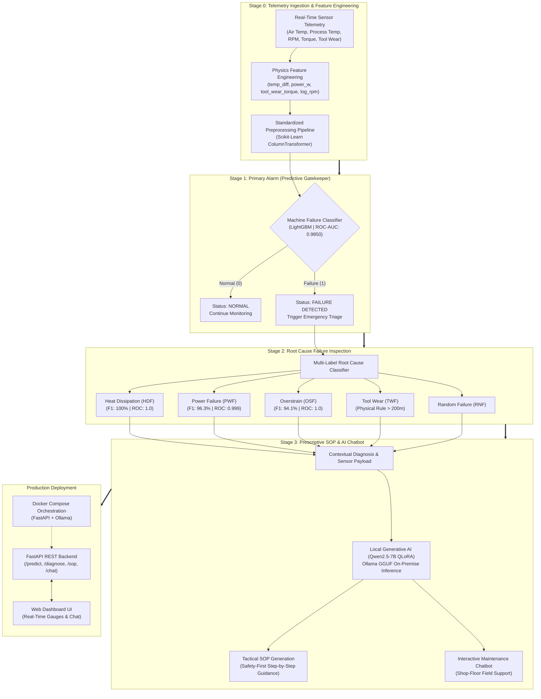

# Maintain — Dual-AI Industrial Predictive Maintenance & Generative SOP Assistant


-8A2BE2?style=flat)


---
⏳ **COMPFEST 18 Artificial Intelligence Competition (AIC) — Submission Under Review**  
Developed by **Team Prompt & Pray**
---

> [!NOTE]
> **Personal Documentation Showcase**  
> This repository serves as a dedicated personal documentation showcase highlighting Edwin Antonie's specific engineering contributions to the **Maintain** platform. For the original collaborative team repository containing full multi-author commit histories across all development phases, please visit [**`EdwinAntoniee/Maintain_PromptAndPray`**](https://github.com/EdwinAntoniee/Maintain_PromptAndPray).

## Project Overview
**Maintain** is an industrial-grade Prescriptive Maintenance platform engineered to eliminate costly unplanned machine downtime in modern manufacturing environments. Developed for the COMPFEST 18 Artificial Intelligence Competition (AIC), the system operates on a cutting-edge **Dual-AI Architecture** that fuses tabular Predictive Machine Learning with local Generative AI:

1. **Predictive AI Engine**: Ingests real-time telemetry sensors (temperatures, rotational speed, torque, tool wear) from the AI4I 2020 dataset to execute a two-stage diagnostic triage—first detecting whether a failure is imminent, then classifying the exact physical root-cause failure mode across multiple categories.
2. **Generative AI & Chatbot Assistant**: A domain-adapted Large Language Model (Qwen2.5-7B-Instruct fine-tuned via QLoRA) that transforms statistical failure flags into tactical, safety-first Standard Operating Procedures (SOPs) and provides an interactive technical chatbot for shop-floor technicians.
3. **Full-Stack Application**: A production-ready FastAPI backend and responsive web frontend fully containerized using Docker and Docker Compose, enabling private on-premise execution with zero cloud dependency.

## Key Features
- **Physics-Informed Exploratory Data Analysis**: Deep statistical examination of 10,000 sensor telemetry records, mapping thermodynamics, rotational mechanics, and failure thresholds.
- **Engineered Physical Domain Features**: Formulated features derived from first principles: temperature differentials (`temp_diff`), mechanical power in watts (`power_w`), and tool wear-torque interaction indices (`tool_wear_torque`).
- **Stage 1 Primary Predictive Gatekeeper**: High-sensitivity LightGBM binary classifier achieving **0.9850 ROC-AUC** and **86.76% Recall**, ensuring critical machine failures are caught before catastrophic stoppage.
- **Stage 2 Multi-Label Root Cause Diagnostics**: Specialized classifier isolating five distinct failure modes with near-perfect deterministic accuracy:
  - **Heat Dissipation Failure (HDF)**: **100% Recall | 100% F1 | 1.0000 ROC-AUC**
  - **Power Failure (PWF)**: **100% Recall | 96.3% F1 | 0.9999 ROC-AUC**
  - **Overstrain Failure (OSF)**: **100% Recall | 94.1% F1 | 1.0000 ROC-AUC**
  - **Tool Wear Failure (TWF)**: Proactive physical wear rule triggers (>200 min).
  - **Multi-Failure Edge Cases**: Handles co-occurring failure states (e.g., thermal and mechanical stresses).
- **Stage 3 Prescriptive SOP Generation & Technical Chatbot**: Local Qwen2.5-7B-Instruct model (GGUF 4-bit quantized via Ollama) generating step-by-step Indonesian repair SOPs with strict safety-first protocols and real-time conversational assistance.
- **FastAPI Backend & Interactive Web UI**: Asynchronous REST API providing real-time telemetry inference, health gauge visualizers, diagnostic breakdowns, and interactive technician chat.
- **Containerized Microservices**: Orchestrated with Docker Compose, integrating the FastAPI web service with a local Ollama LLM inference container for private industrial deployment.

## My Roles & Contributions
- **Exploratory Data Analysis (EDA) & Data Management**
  - Conducted comprehensive descriptive, bivariate, and target correlation analyses across the 10,000-record AI4I 2020 predictive maintenance dataset.
  - Profiled distributions across key sensor signals (Air Temperature, Process Temperature, Rotational Speed, Torque, Tool Wear), discovering right-skewed RPM behavior and critical operating boundaries.
  - Handled end-to-end data cleaning, anomaly verification, and stratified train/test partitioning, delivering pristine, reproducible data splits (`X_train`, `X_test`, `y_train`, `y_test`) that empowered teammates to train predictive algorithms and fine-tune language models.
- **Physics-Informed Feature Engineering**
  - Partook in mathematical and domain-logic feature engineering to unlock deterministic physical failure patterns:
    - `temp_diff`: Calculated Process Temperature minus Air Temperature, unlocking 100% precision in detecting Heat Dissipation Failures (HDF).
    - `power_w`: Derived mechanical power output ($\text{Torque} \times \text{Rotational Speed}$ in Watts), enabling near-flawless Power Failure (PWF) isolation.
    - `tool_wear_torque`: Quantified mechanical strain by interacting tool wear duration with operational torque, capturing 100% of Overstrain Failures (OSF).
    - `log_rpm`: Log-transformed rotational speed to normalize skewed distributions for linear and distance-based baseline models.
- **Preprocessing Pipeline Architecture**
  - Designed and verified leak-free Scikit-Learn transformation pipelines (`ColumnTransformer`, `StandardScaler`, `OneHotEncoder`), ensuring consistent feature alignment between training, validation, and live inference.
- **Cross-Functional Team Collaboration**
  - Actively coordinated with Team Prompt & Pray teammates to integrate the data preprocessing foundation into the larger full-scale system architecture, connecting predictive ML models, the QLoRA generative SOP engine, and the FastAPI application layer.

## Architecture
The system employs a Three-Stage Operational Triage powered by a Dual-AI engine:



## Folder Structure
```
Maintain-Dual-AI-Prescriptive-Maintenance/
├── BackEnd/                      # FastAPI backend application
│   ├── api/                      # REST route definitions and Pydantic schemas
│   ├── core/                     # ML inference engine and LLM Ollama service
│   ├── models/                   # Serialized ML pipelines and model metadata
│   ├── src/                      # Pipeline utility functions
│   ├── Dockerfile                # Backend containerization Dockerfile
│   ├── main.py                   # FastAPI server entry point
│   └── requirements.txt          # Backend Python dependencies
├── FrontEnd/                     # Interactive web user interface
│   ├── app.js                    # Telemetry input handling, API calls, and chat logic
│   ├── index.html                # Application dashboard markup
│   └── styles.css                # Industrial dashboard styling
├── data/                         # Datasets directory
│   ├── raw/ai4i2020.csv          # Raw AI4I 2020 predictive maintenance dataset
│   └── processed/                # Stratified train/test partitions (X/y train/test)
├── models/                       # Serialized model artifacts
│   ├── best_model.pkl            # Stage 1 binary failure classifier
│   ├── multi_label_model.pkl     # Stage 2 root-cause diagnostic model
│   ├── smart_maintenance_pipeline.pkl # End-to-end inference pipeline
│   ├── scaler.pkl                # Standardized feature scaler
│   └── best_threshold.pkl        # Optimal decision threshold
├── notebooks/                    # Research and development notebooks
│   ├── 01_eda_descriptive.ipynb  # Descriptive statistical analysis
│   ├── 02_eda_relationships.ipynb# Sensor correlation and relationship analysis
│   ├── 03_eda_target_analysis.ipynb # Failure target and imbalance profiling
│   ├── 04_preprocessing.ipynb    # Data cleaning and feature engineering
│   ├── 05_model_training.ipynb   # Multi-model training and evaluation
│   ├── 06_llm_finetuning.ipynb   # QLoRA fine-tuning for Qwen2.5-7B
│   └── 07_pipeline_export.ipynb  # Production pipeline serialization
├── reports/                      # Visualizations and comprehensive metrics
│   ├── figures/                  # Correlation heatmaps, boxplots, and distributions
│   └── model_performance_evaluation.md # Technical evaluation and benchmark report
├── src/                          # Modular training and data loading scripts
│   ├── data_loader.py            # Automated dataset ingestion routines
│   ├── eda_utils.py              # Data visualization helper functions
│   ├── pipeline_utils.py         # Custom pipeline transformers
│   └── sop_dataset.jsonl         # QLoRA fine-tuning training dataset
├── .gitignore                    # Excludes bytecode, envs, and GGUF binaries
├── docker-compose.yml            # Multi-container Docker deployment configuration
└── requirements.txt              # Top-level dependencies for model development
```

## Getting Started

### Option 1: Explore Analysis & Model Development (Local)

1. Clone the repository:
   ```bash
   git clone https://github.com/EdwinAntoniee/Maintain-Dual-AI-Prescriptive-Maintenance.git
   cd Maintain-Dual-AI-Prescriptive-Maintenance
   ```

2. Create and activate a virtual environment:
   - **Windows (PowerShell):**
     ```powershell
     python -m venv venv
     .\venv\Scripts\Activate.ps1
     ```
   - **macOS / Linux:**
     ```bash
     python3 -m venv venv
     source venv/bin/activate
     ```

3. Install development dependencies:
   ```bash
   pip install -r requirements.txt
   ```

4. Launch Jupyter Notebook to explore the analytical pipeline:
   ```bash
   jupyter notebook
   ```
   *Follow the notebooks sequentially (`01` through `07`) to review data exploration, feature engineering, model training, and LLM fine-tuning.*

---

### Option 2: Run the Full-Stack Application (Docker + Ollama)

#### Prerequisites
- [Docker & Docker Compose](https://www.docker.com/)
- [Ollama](https://ollama.com/) installed on the host machine

#### Step 1: Set Up the Prescriptive LLM Model
1. Download the fine-tuned `.gguf` model and its `Modelfile` from our [Team Google Drive](https://drive.google.com/file/d/1LzGVKWS1hSP6TNHwD9AYldaVgjhWCjxp/view?usp=sharing).
2. Place both downloaded files in:
   ```
   BackEnd/models/qwen-sop-model_gguf/
   ```
3. Open a terminal in that directory and register the model with Ollama:
   ```bash
   ollama create qwen-model -f Modelfile
   ```
4. Verify the model is ready:
   ```bash
   ollama list
   ```

#### Step 2: Launch with Docker Compose
1. Ensure Ollama is running on port `11434`:
   ```bash
   ollama serve
   ```
2. From the repository root, start the application:
   ```bash
   docker-compose up --build
   ```
3. Access the services:
   - **Web Interface:** [http://localhost:8000](http://localhost:8000)
   - **Interactive API Documentation:** [http://localhost:8000/docs](http://localhost:8000/docs)

4. To stop the application:
   ```bash
   docker-compose down
   ```
